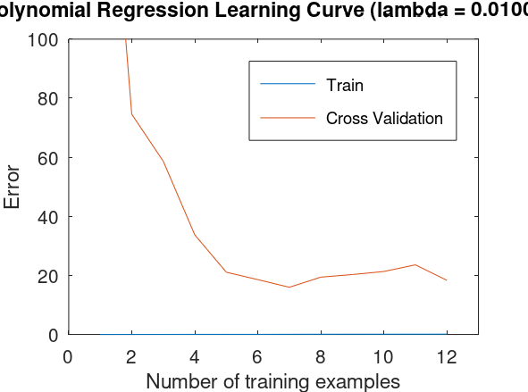

# (Week 6) Ex5: Regularized Linear Regression and Bias v.s.Variance

`linearRegCostFunction.m`

```matlab
% ====================== YOUR CODE HERE ======================

h = X * theta;
J = 1 / 2 / m * (h - y)' * (h - y) + lambda / 2 / m * sum(theta(2:end) .^ 2);
grad(1) = 1 / m * X(:, 1)' * (h - y);
grad(2:end) = 1 / m * X(:, 2:end)' * (h - y) + lambda / m * theta(2:end);

% =========================================================================
```

`learningCurve.m`

```matlab
% ====================== YOUR CODE HERE ======================

for i = 1:m
  [theta] = trainLinearReg(X(1:i, :), y(1:i, :), lambda)
  error_train(i) = linearRegCostFunction(X(1:i, :), y(1:i, :), theta, 0);
  error_val(i) = linearRegCostFunction(Xval, yval, theta, 0);
end

% =========================================================================
```

`polyFeatures.m`

```matlab
% ====================== YOUR CODE HERE ======================

for i = 1:p
  X_poly(:, i) = X .^ i;
end

% =========================================================================
```

`validationCurve.m`

```matlab
% ====================== YOUR CODE HERE ======================

for i = 1:length(lambda_vec)
  lambda = lambda_vec(i);
  [theta] = trainLinearReg(X, y, lambda);
  error_train(i) = linearRegCostFunction(X, y, theta, 0);
  error_val(i) = linearRegCostFunction(Xval, yval, theta, 0);
end

% =========================================================================
```

---

I have also finished the optional part. I have appended a few lines of code to the end of `ex5.m` for part 3.4 and have created a new scripts named `avgLearningCurve.m` for part 3.5.

`ex5.m`

```matlab
% ============= Optional: Computing test set error ===============
fprintf('Computing the error of testset...\n');
best_lambda = 3;
[theta] = trainLinearReg(X_poly, y, best_lambda);
error_test = linearRegCostFunction(X_poly_test, ytest, theta, 0);
fprintf('Test error %f\n', error_test);
```

`avgLearningCurve.m`

I followed the instructions in ex5.pdf and finally plotted a figure similar to the one in the pdf file, which is shown below. But I have got a question for this: why should we also select *i* examples from validation set for computing the corresponding error, instead of using the whole validation set like what we have done in the original non-loop version in the scripts `learningCurve.m` ?



```matlab
% =====Optional: Plotting learning curves with randomly selected examples=====

function [error_train, error_val] = ...
    avgLearningCurve(X, y, Xval, yval, lambda)

maxloop = 50;
m_val = size(Xval, 1);
for i = 1:m
  for j = 1:maxloop
    idx_train = randi(m, i, 1);
    idx_val = randi(m_val, i, 1);
    [theta] = trainLinearReg(X(idx_train, :), y(idx_train, :), lambda)
    error_train(i) += linearRegCostFunction(X(idx_train, :), y(idx_train, :), theta, 0);
    error_val(i) += linearRegCostFunction(Xval(idx_val, :), yval(idx_val, :), theta, 0);
  end
  error_train(i) /= maxloop;
  error_val(i) /= maxloop;
end

end
```
